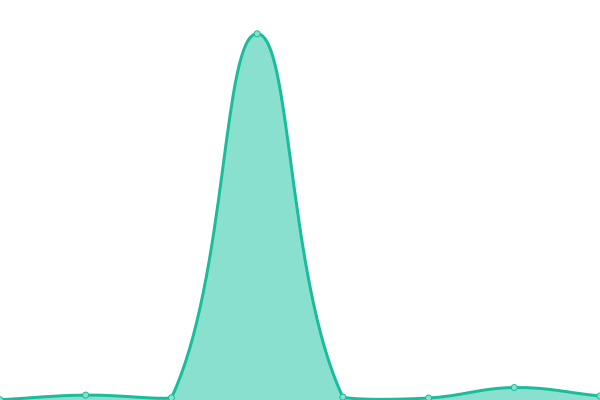

# [📈 Live Status](https://ibakshay.github.io/test-uptime-2): <!--live status--> **🟧 Partial outage**

This repository contains the open-source uptime monitor and status page for [Akshay Iyyadurai Balasundaram](https://ibakshay.com/), powered by [Upptime](https://github.com/upptime/upptime).

With [Upptime](https://upptime.js.org), you can get your own unlimited and free uptime monitor and status page, powered entirely by a GitHub repository. We use [Issues](https://github.com/ibakshay/test-uptime-2/issues) as incident reports, [Actions](https://github.com/ibakshay/test-uptime-2/actions) as uptime monitors, and [Pages](https://ibakshay.github.io/test-uptime-2) for the status page.

<!--start: status pages-->
<!-- This summary is generated by Upptime (https://github.com/upptime/upptime) -->
<!-- Do not edit this manually, your changes will be overwritten -->
<!-- prettier-ignore -->
| URL | Status | History | Response Time | Uptime |
| --- | ------ | ------- | ------------- | ------ |
|  [Google](https://www.google.com) | 🟩 Up | [google.yml](https://github.com/ibakshay/test-uptime-2/commits/HEAD/history/google.yml) | 

 85ms
     
 | 

<a href="https://ibakshay.github.io/test-uptime-2/history/google">100.00%</a>
    

|  [CLA assistant](https://cla-assistant.io) | 🟩 Up | [cla-assistant.yml](https://github.com/ibakshay/test-uptime-2/commits/HEAD/history/cla-assistant.yml) | 

 250ms
     
 | 

<a href="https://ibakshay.github.io/test-uptime-2/history/cla-assistant">100.00%</a>
    

|  [Hacker News](https://news.ycombinator.com) | 🟩 Up | [hacker-news.yml](https://github.com/ibakshay/test-uptime-2/commits/HEAD/history/hacker-news.yml) | 

 337ms
     
 | 

<a href="https://ibakshay.github.io/test-uptime-2/history/hacker-news">100.00%</a>
    

|  [Broken Site](https://thissitedoesnotexist.com) | 🟥 Down | [broken-site.yml](https://github.com/ibakshay/test-uptime-2/commits/HEAD/history/broken-site.yml) | 

 0ms
     
 | 

<a href="https://ibakshay.github.io/test-uptime-2/history/broken-site">100.00%</a>
    

|  [Test for HEAD](https://www.google.com) | 🟩 Up | [test-for-head.yml](https://github.com/ibakshay/test-uptime-2/commits/HEAD/history/test-for-head.yml) | 

 19ms
     
 | 

<a href="https://ibakshay.github.io/test-uptime-2/history/test-for-head">100.00%</a>
    

<!--end: status pages-->

[**Visit our status website →**](https://ibakshay.github.io/test-uptime-2)

## 📄 License

- Powered by: [Upptime](https://github.com/upptime/upptime)
- Code: [MIT](./LICENSE) © [Akshay Iyyadurai Balasundaram](https://ibakshay.com/)
- Data in the `./history` directory: [Open Database License](https://opendatacommons.org/licenses/odbl/1-0/)
